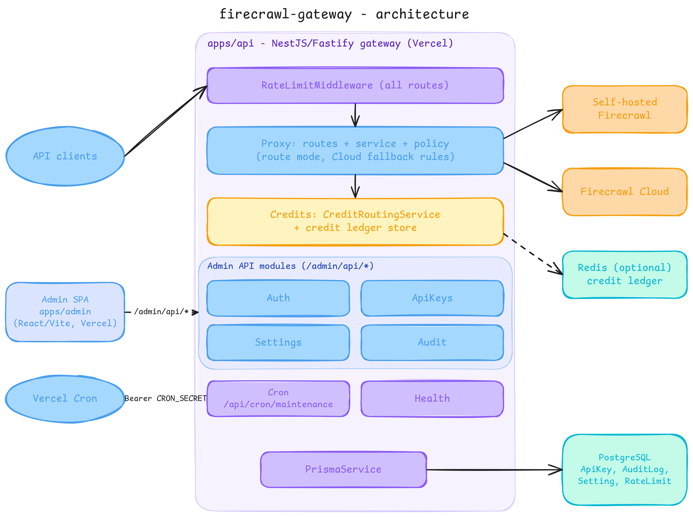

# Firecrawl Gateway

Firecrawl Gateway is an independently deployed gateway for operators who use Firecrawl Cloud, a self-hosted Firecrawl run from this repository's Docker Compose stack, or both. It provides one API boundary for compatible Firecrawl requests, routing controls, global virtual API keys, and an operator dashboard for settings and audit data.

This repository is a separate gateway application, not Firecrawl or PostgreSQL, and claims no official affiliation. It ships a Docker Compose stack in [`deploy/firecrawl`](deploy/firecrawl/docker-compose.yml) for self-hosting Firecrawl, but does not host PostgreSQL or Firecrawl Cloud. Upstream availability, feature compatibility, account access, and billing for Cloud and PostgreSQL remain the responsibility of those external services.

## Why this exists

Keep Firecrawl-compatible clients pointed at one gateway origin while deciding where eligible work runs: the self-hosted Firecrawl from `deploy/firecrawl`, Firecrawl Cloud, or a policy-controlled fallback. It issues `fc_`-prefixed virtual API keys, lets the single administrator configure Cloud keys and routing from a dashboard, and records outcomes in PostgreSQL-backed audit data. It is not a promise of full upstream feature parity: Cloud-managed requests still need Cloud, and sensitive or private requests face stricter fallback rules.

## Architecture

The Bun-workspace Turborepo contains two independently deployable apps:

- `apps/api` — a native NestJS API on the Fastify adapter. It authenticates virtual API keys, applies route policy, proxies `/v1/*` and `/v2/*`, and exposes health, readiness, administration, and maintenance routes.
- `apps/admin` — a root-hosted React/Vite admin SPA. It calls authenticated `/admin/api/*` endpoints on the API and does not run under an `/admin` URL prefix.

The gateway calls the self-hosted Firecrawl (this repository's Docker Compose stack) directly at `FIRECRAWL_SELF_HOSTED_URL`, which defaults to `http://127.0.0.1:3002`; it is not an admin setting. Cloud API keys are encrypted in PostgreSQL. PostgreSQL is also the source for global settings, API keys, audit logs, and shared rate-limit state; the repository does not add a file-based audit store.

## Routing and operational boundaries

The configured default route mode can be one of:

- `self-hosted-first` — use the self-hosted Firecrawl first and fall back to Cloud for eligible requests.
- `self-hosted-only` — never send requests to Cloud; Cloud-required requests are rejected.
- `cloud-first` — use Cloud first and fall back to self-hosted when an eligible, non-Cloud-required request cannot use the configured Cloud credit pool.
- `cloud-only` — use Cloud exclusively.

Some paths and request options require Cloud-managed behavior, including examples such as agent, browser, monitor, research, and Fire-engine-backed actions. The gateway routes those requests to Cloud when possible and rejects them in `self-hosted-only` mode. Fallback is policy-controlled rather than a generic retry: the self-hosted-first path does not fall back when sensitive upstream headers or cookies, sensitive body headers, or private target URLs are present.

The API's security and runtime boundaries are deliberate:

- With authentication enabled, clients send a virtual API key as a Bearer token. Plaintext is returned only when a key is created; store it securely.
- The single administrator is configured with `ADMIN_EMAIL` and `ADMIN_PASSWORD`; those credentials are not stored in PostgreSQL. Admin sessions use signed HTTP-only cookies.
- `ADMIN_ORIGIN` and `API_ORIGIN` should be exact deployed origins for credentialed CORS; do not use `*` for this setup.
- Request bodies are inspected and forwarded as UTF-8 JSON. Binary uploads and Latin-1 text can be corrupted in transit, so this gateway is not a general binary proxy.
- Upstream requests time out after `API_REQUEST_TIMEOUT_MS` (120 seconds by default). The maintenance endpoint, which an external scheduler must call daily, permanently removes audit entries older than 30 days.
- Prisma migrations are not applied during API startup. The single-admin cutover is destructive and requires explicit approval; see [`RELEASING.md`](RELEASING.md) and [`SELF_HOST.md`](SELF_HOST.md).

## Getting started

Follow [`QUICKSTART.md`](QUICKSTART.md) for local development and running the API and admin, and [`.env.example`](.env.example) for configuration. Prisma migrations are never applied by builds, the typecheck workflow, or API startup; the single-admin cutover is destructive, so review [`RELEASING.md`](RELEASING.md) before running `bun run db:migrate`.

## Documentation

- [`QUICKSTART.md`](QUICKSTART.md) — local development and running the API and admin
- [`SELF_HOST.md`](SELF_HOST.md) — self-hosted Firecrawl (Docker Compose) and PostgreSQL configuration
- [`apps/api/README.md`](apps/api/README.md) — API routes and Prisma operations
- [`docs/DESIGN.md`](docs/DESIGN.md) — admin UI design rules
- [`CONTRIBUTING.md`](CONTRIBUTING.md) — development and pull request guidance
- [`SUPPORT.md`](SUPPORT.md) — non-sensitive support and issue routing
- [`SECURITY.md`](SECURITY.md) — vulnerability reporting and secret hygiene
- [`RELEASING.md`](RELEASING.md) — version, tag, release, and deployment checklist
- [`CODE_OF_CONDUCT.md`](CODE_OF_CONDUCT.md) — community participation standards
- [`CHANGELOG.md`](CHANGELOG.md) — unreleased repository changes
